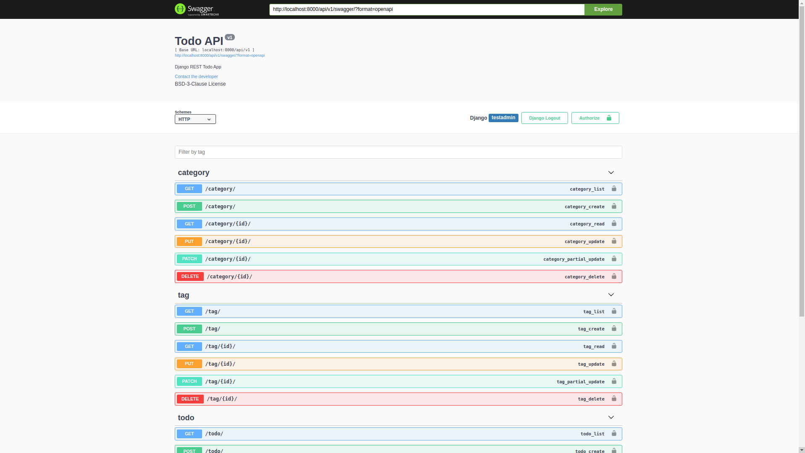
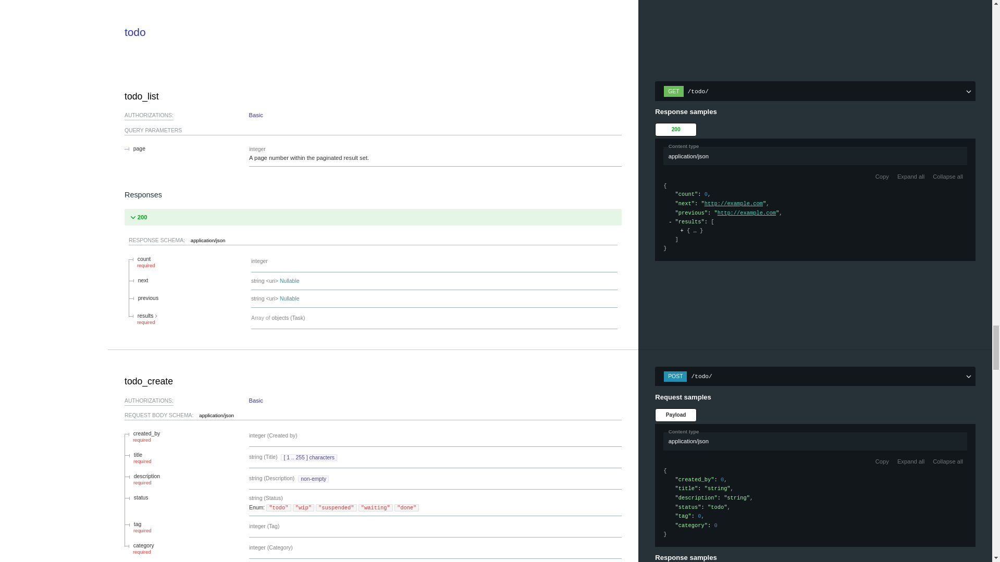
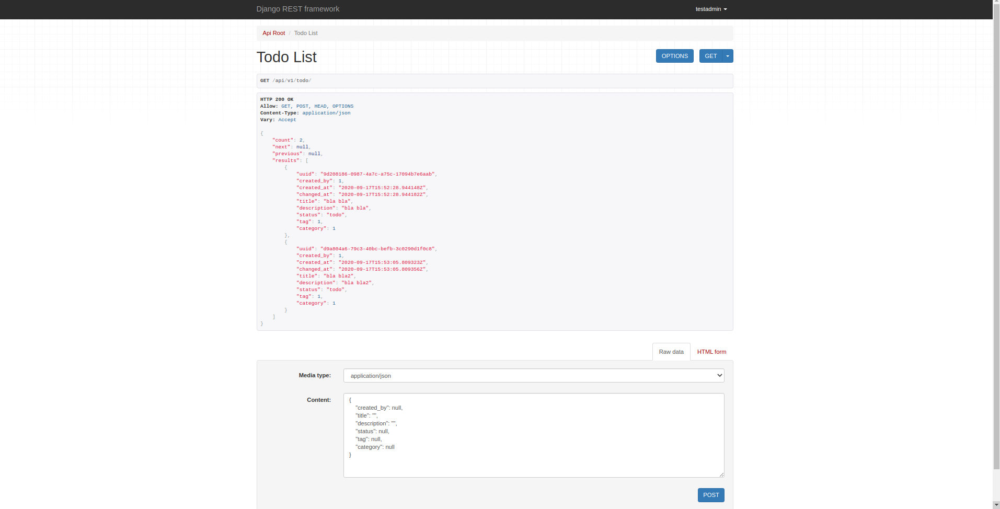

[](https://opensource.org/licenses/bsd-3-clause)
[](https://github.com/ambv/black)

# # YADRTA

__Yet Another Djando REST Todo App__ using django rest and django with [OpenAPI Specification].


_swagger_


_redoc_


_django rest api_

## ## Getting Started

This app gets requests from `localhost` on port `8000` and performs __CRUD__
operations.

Base endpoints are:
- The base endpoint is: http://localhost:8000
- `base_url` for __API v1__ is `/api/v1/`
- Session Authentication: `/api-auth/login/` `/api-auth/logout/`
- Admin panels: `/admin/`

__CRUD API__ endpoints:
- `/api/v1/category/`
- `/api/v1/tag/`
- `/api/v1/todo/`

For documemtation:
- `/api/v1/doc/swagger/`
- `/api/v1/doc/swagger.yaml`
- `/api/v1/doc/swagger.json`
- `/api/v1/doc/redoc/`


### ### Prerequisites

- Python 3.8
- [httpie] - (optional) | Modern alternative for `curl`

### ### Installing

Clone the repo with `ssh`:

```bash
$ git clone https://github.com/SerhatTeker/yadrta.git
```

or with `https`:

```bash
$ git clone git@github.com:SerhatTeker/yadrta.git
```

### ### Getting Up and Running Locally

#### #### Setting Up Development Environment

1. Create a virtualenv:

    ```bash
    $ virtualenv -p python3.8 .venv
    ```

2. Activate the virtualenv you have just created:

    ```bash
    $ source .venv/bin/activate
    ```

3.  Install development requirements:

    ```bash
    $ pip install -r requirements.txt
    ```

4. Apply migrations:

    ```bash
    $ python manage.py migrate
    ```

5. Run Django development server:

    ```bash
    $ python manage.py runserver 8000
    ```

    or you can use __Makefile__:

    ```bash
    $ make runserver
    # or shorter : default make target is `runserver`
    # $ make
    ```

#### #### Summary

Congratulations, you have made it!

## ## Usage

Activate _virtual environment_ and run _django development server_:

```bash
$ source .venv/bin/activate
$ python manage.py runserver 8000
```

### ### Authentication

This app uses 2 different `auth` methods:

- [Session Authentication]
- [Token Authentication]

#### #### Create User

```bash
$ curl -d '{"username":"testuser", "password":"testuser", "email":"testuser@testapi.com"}' \
	     -H "Content-Type: application/json" \
	     -X POST http://localhost:8000/api/v1/users/
```

#### #### Create Superuser

1. From `manage.py` cli utility tool:

```bash
$ python manage.py createsuperuser --username testdamin --email testadmin@testapi.com
```

2. From `make` target:

First you need to define the environment variable : `DJANGO_DEV_ADMIN`.

```bash
# DJANGO_DEV_ADMIN=name:email:password
DJANGO_DEV_ADMIN=testadmin:testadmin@testapi.com:123asX3?23
```

Then run;

```bash
$ make createsuperuser
```

which will run:

```make
createsuperuser:
	@echo "from django.contrib.auth import get_user_model; User = get_user_model(); User.objects.create_superuser(*'${DJANGO_DEV_ADMIN}'.split(':'))" | python manage.py shell
```

#### #### Getting User Token

Run :

```bash
$ http http://localhost:8000/api-token-auth/ username=testuser password=testuser
```

Output will be like:

```bash
HTTP/1.1 200 OK
Allow: POST, OPTIONS
Content-Length: 52
Content-Type: application/json
Date: Tue, 22 Sep 2020 13:57:46 GMT
Referrer-Policy: same-origin
Server: WSGIServer/0.2 CPython/3.8.1
Vary: Cookie
X-Content-Type-Options: nosniff
X-Frame-Options: DENY

{
    "token": "80ca0dadab06b34623a6b8279320e8341e2a5102"
}
```

#### #### Login

Use one of the below endpoints:

- `/admin/`
- `/api-auth/login/`

### ### API v1

`curl`:

```bash
$ curl -X GET http://localhost:8000/api/v1/todo/ \
		-H 'Authorization: Token <user_token>' \
		-H 'Accept: application/json; indent=4'
```

After those you will get below _todo sample api response_:

#### #### Sample API Responses

`/category/`

```json
{
    "count": 2,
    "next": null,
    "previous": null,
    "results": [
        {
            "uuid": "25696439-a580-4489-9e5a-6172d0954430",
            "created_by": 1,
            "created_at": "2020-09-17T15:51:26.527025Z",
            "changed_at": "2020-09-17T15:51:26.527058Z",
            "name": "business"
        },
        {
            "uuid": "89e875b3-ae1d-4a91-a8d0-b4975127d97f",
            "created_by": 1,
            "created_at": "2020-09-17T15:51:38.682076Z",
            "changed_at": "2020-09-17T15:51:38.682147Z",
            "name": "learning"
        }
    ]
}
```

`/tag/`

```json
{
    "count": 2,
    "next": null,
    "previous": null,
    "results": [
        {
            "uuid": "d1911f18-8a49-457c-aa72-b1e9ae9e198d",
            "created_by": 1,
            "created_at": "2020-09-17T15:49:42.392670Z",
            "changed_at": "2020-09-17T15:49:42.392730Z",
            "name": "newthing"
        },
        {
            "uuid": "a95acc20-483c-43de-83e7-c6fe44ba4f2e",
            "created_by": 1,
            "created_at": "2020-09-17T15:49:56.709027Z",
            "changed_at": "2020-09-17T15:49:56.709064Z",
            "name": "language"
        }
    ]
}
```

`/todo/`

```json
{
    "count": 2,
    "next": null,
    "previous": null,
    "results": [
        {
            "uuid": "9d208186-0987-4a7c-a75c-17094b7e6aab",
            "created_by": 1,
            "created_at": "2020-09-17T15:52:28.944148Z",
            "changed_at": "2020-09-17T15:52:28.944182Z",
            "title": "bla bla",
            "description": "bla bla",
            "status": "todo",
            "tag": 1,
            "category": 1
        },
        {
            "uuid": "d9a804a6-79c3-40bc-befb-3c0290d1f0c8",
            "created_by": 1,
            "created_at": "2020-09-17T15:53:05.809323Z",
            "changed_at": "2020-09-17T15:53:05.809356Z",
            "title": "bla bla2",
            "description": "bla bla2",
            "status": "todo",
            "tag": 1,
            "category": 1
        }
    ]
}
```

## Versioning

We use [SemVer](http://semver.org/) for versioning. For the versions available,
see the [tags on this repository](https://github.com/serhatteker/yadrta/tags).

## Authors

* **Serhat Teker** [serhatteker](https://github.com/serhatteker)

## License

This project is licensed under the BSD-3-Clause License - see the
[LICENSE.md](LICENSE.md) file for details.


[httpie]: https://github.com/httpie/httpie
[OpenAPI Specification]: https://swagger.io/specification/
[Session Authentication]: https://www.django-rest-framework.org/api-guide/authentication/#sessionauthentication
[Token Authentication]: https://www.django-rest-framework.org/api-guide/authentication/#tokenauthentication
